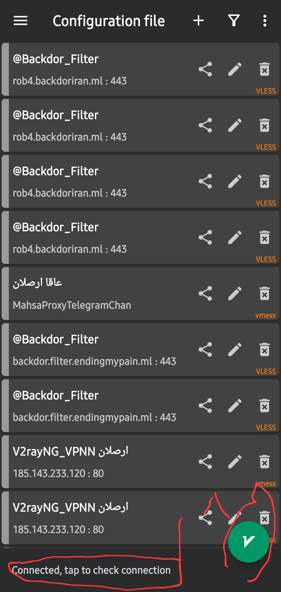
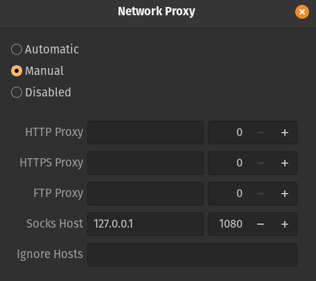

 <div align="center">
  <a href="">
    
  </a>
</div>
<br/>

# v2ray-vpn

<div align="center">
Instruction on how install and run v2ray protocol on both server and Client
</div>

## Server side
1. Login to your server using ssh:

```sh
ssh user@server_ip
```
2. Run the fowllowing commend. This will install and config v2ray on your server:

```sh
bash <(curl -Ls https://raw.githubusercontent.com/vaxilu/x-ui/master/install.sh)
```
3. After instulation a wizard shows up and will ask you to enter:
 * (1) A user name for vpn panel
 * (2) A password for your panel
 * (3) A port to access your panel
  
  <div >
  <a href="https://github.com/othneildrew/Best-README-Template">
    
  </a>
</div>

<br />
  4. After setting up username, password and a port, your panel is ready. login to it in a browser with your server ip and the port that you enter in wizard proccess:
  
  ```sh
  your_server_ip:port
  ```
  
  <br />
  
  5. Login to your panel and it will look like this. to add users klick on second option in right panel:
  
  <br />
  
  <div >
  <a href="https://github.com/othneildrew/Best-README-Template">
    
  </a>
</div>

<br />

6. click on plus sign and enter a name for the new user. Instead off ```tcp``` select ```ws``` as protocol:

<br />

  <div >
  <a href="https://github.com/othneildrew/Best-README-Template">
    
  </a>
</div>

<br/>

7. click on option minue for each user and select qr code to copy or scan the credentials:

<br/>
  <div >
  <a href="https://github.com/othneildrew/Best-README-Template">
    
  </a>
</div>

<br/>

## Client : Mobile
* Install V2rayNG app on google play. [Click here](https://play.google.com/store/apps/details?id=com.v2ray.ang&hl=en&gl=US).
* Open the app and click on plus sign at the top corner
* Select one off options `Import config from QR code` or `Impport config from clipboard` and import the credentials
* When credentials added click on floating button at the bottom , when button turns to green then click on rectangle under the button:
  <div>
  <a href="https://github.com/othneildrew/Best-README-Template">
    
  </a>
</div>


<br/>

## Client : Windows
* Download the V2rayNCore app for windows. [Click here](https://github.com/2dust/v2rayN/releases/download/5.36/v2rayN-Core.zip).
* Extract the downloaded zip and open ``` v2rayN.exe ``` file. 
* Change the language to english by click on help icon at the top menu then restart the application:
<br/>

 <div>
  <a href="https://github.com/othneildrew/Best-README-Template">
    
  </a>
</div>
<br/>

* Import the credentials by click on ``servers`` menu and select ``Import bulk url from clipboard``
* Right click on try icon of the app in the notification bar and select ``system proxy`` then select ``set system proxy``
<br/>

 <div>
  <a href="https://github.com/othneildrew/Best-README-Template">
    
  </a>
    
</div>
  <br/>
  
* If the icon turns into red then you are good to go. but if is fails to connect, changing the ```listening port``` in ```settings``` then ```OpetionSettings``` will solve most of the issues.


<br/>

## Client : Linux
* Download V2ray for linux. [Click here](https://chat.google.com/u/0/api/get_attachment_url?url_type=DOWNLOAD_URL&attachment_token=AOkZXXQYOY6c0KPD%2B68a2EkUXQIHMYzF1g9Y9YSfucReXR6bypoEh5GxS3Sg7GFivIo%2BWHhdj9CHRVUeYTIHykBAIBLIt0GZybNZL1KRAkdgiJmp3Q4h5HUqcDhDR9mmsL6WtWu65LyCptb8qNRpDJUMezou87YrIHQUC3NY6nUG4OJv0jQAE0NkK8EKGakdIs40fKYUKNjTPZmY9iaspFouUuyDXAL%2FRmfTl3eQY8N8L5s%2Be5ROCQNgrW%2BcnXfRb7LGYkOEPWMKP5jQ1lh7YEnB1xqYaSdX1RHPu7W4%2Fi%2B2sFeTBm2aaPasQRcWqwI3qgKhW0%2F%2FUsbPdNQBTPCaa1787b0bEAI7gKQNaxmlHUbOz726UrGeuj3QN4rziBWBvzYn0qiPkDMO8tTYJa5MWiYrw0PQNdTlJMnD1duXawoSqUN0RldizaSN4c5fDyevVzmZXxeKuGFi%2Fw4wCe6pmeCpjQgYQ64IVeXqdbeNDbZemwJwaAo%3D&content_type=application%2Fzip&auto=true).
* Unzip the file and copy following config in ```config.json```. modify it based on server address and received port:
```sh
{
  "inbounds": [
      {
          "port": 1080,
          "listen": "127.0.0.1",
          "protocol": "socks"
      }
  ],
  "outbounds": [
      {
          "protocol": "vmess",
          "settings": {
              "vnext": [
                  {
                      "address": "server_address", //Your server address
                      "port": 34021, // created user port. you cand find this ..in v2ray panel.
                      "users": [
                          {
                              "id": "6dc2583f-9360-444a-b091-6318f90a7e3f",
                              "alterId": 0
                          }
                      ]
                  }
              ]
          },
          "streamSettings": {
              "network": "tcp",
              "security": "tls"
          }
      }
  ]
}
```

<br/>

* Go to ``settings->network->Network proxy``. Select ``Manual`` option and fill the values as shown in the image below:

<br/>

 <div>
  <a href="https://github.com/othneildrew/Best-README-Template">
    
  </a>
    
</div>
  <br/>
  
* In v2ray directory that you just extract it open terminal and run ``` ./v2ray -config=config.json ``` commend.

<br/>

#### Note: If you are using ARM cpu download [This File](https://github.com/v2ray/v2ray-core/releases/download/v4.26.0/v2ray-linux-arm.zip), extract it then in that directory run terminal and execute ``` ./v2ray_armv7 run ``` .
